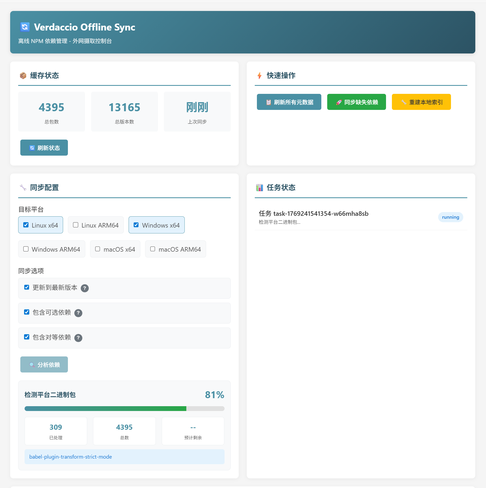
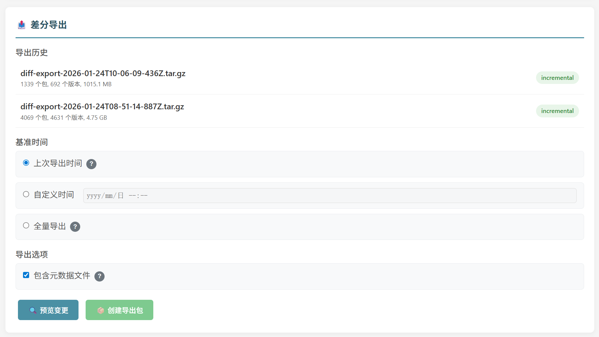

# Verdaccio Offline Sync

English | [中文](./README.md)

[](https://www.npmjs.com/package/verdaccio-ingest-middleware)
[](https://www.npmjs.com/package/verdaccio-metadata-healer)
[](https://www.npmjs.com/package/@jayxuz/verdaccio-offline-storage)
[](https://opensource.org/licenses/MIT)


**Verdaccio Offline NPM Dependency Management Plugin Suite** - An npm package synchronization solution designed for air-gapped environments.

## Key Features

- **Recursive Dependency Download** - Automatically analyzes and downloads complete dependency trees
- **Multi-Platform Binary Support** - Supports Linux/Windows/macOS with x64/arm64 architectures
- **Incremental Sync** - Smart incremental updates based on cached packages
- **Differential Export/Import** - Supports time-based differential package export and import
- **Visual Management Interface** - Built-in Web UI with analyze-confirm-download workflow
- **Real-time Progress Tracking** - Displays detailed progress and estimated remaining time
- **Metadata Self-Healing** - Automatically repairs missing package metadata in offline environments

## Plugin Components

| Plugin | Deployment | Function |
|--------|------------|----------|
| `@jayxuz/verdaccio-offline-storage` | Online/Offline | Base storage layer with offline version resolution |
| `verdaccio-ingest-middleware` | Online | Recursive ingestion middleware with Web UI and differential export |
| `verdaccio-metadata-healer` | Offline | Metadata self-healing filter with differential import |

### Web UI Management Interface

<p align="center">
  
</p>

### Differential Export

<p align="center">
  
</p>

### Differential Import

<p align="center">
  
</p>

## Quick Start

### 1. Install Prerequisites

```bash
# Install offline storage plugin (required)
npm install -g @jayxuz/verdaccio-offline-storage
```

### 2. Install Plugins

```bash
# Online environment
npm install -g verdaccio-ingest-middleware

# Offline environment
npm install -g verdaccio-metadata-healer
```

### 3. Configure Online Verdaccio

```yaml
# config-external.yaml
storage: /verdaccio/storage/data

store:
  offline-storage:
    offline: false

uplinks:
  npmjs:
    url: https://registry.npmjs.org

packages:
  '@*/*':
    access: $all
    publish: $authenticated
    proxy: npmjs
  '**':
    access: $all
    publish: $authenticated
    proxy: npmjs

middlewares:
  ingest-middleware:
    enabled: true
    upstreamRegistry: https://registry.npmjs.org
    concurrency: 5
    timeout: 60000
    platforms:
      - os: linux
        arch: x64
        libc: glibc
      - os: linux
        arch: arm64
        libc: glibc
      - os: win32
        arch: x64
      - os: win32
        arch: arm64
    sync:
      updateToLatest: true
      includeDev: false
      includePeer: true
      includeOptional: true
      maxDepth: 10
```

### 4. Configure Offline Verdaccio

```yaml
# config-internal.yaml
storage: /verdaccio/storage/data

store:
  offline-storage:
    offline: true  # Force offline mode

packages:
  '@*/*':
    access: $all
    publish: $authenticated
  '**':
    access: $all
    publish: $authenticated

filters:
  metadata-healer:
    enabled: true
    scanCacheTTL: 60000
    shasumCacheSize: 10000
    autoUpdateLatest: true

# Enable import middleware (optional, for Web UI import)
middlewares:
  metadata-healer:
    enabled: true
    enableImportUI: true
```

## Web UI Guide

Access `http://external:4873/_/ingest/ui` to open the management interface.

### Features

#### 1. Cache Status

Displays current local cache statistics:
- Total packages
- Total versions
- Last sync time

#### 2. Quick Actions

| Button | Function |
|--------|----------|
| Refresh All Metadata | Update metadata for all cached packages from upstream |
| Sync Missing Dependencies | Navigate to sync configuration |
| Rebuild Local Index | Scan storage directory and repair metadata |

#### 3. Sync Configuration

**Target Platform Selection:**
- Linux x64 / ARM64
- Windows x64 / ARM64
- macOS x64 / ARM64

**Sync Options:**
| Option | Description |
|--------|-------------|
| Update to Latest | Check for newer versions of cached packages |
| Include Optional Dependencies | Download optionalDependencies (platform binaries) |
| Include Peer Dependencies | Download peerDependencies |

#### 4. Analyze-Confirm-Download Workflow

```
┌─────────────┐     ┌─────────────┐     ┌─────────────┐
│   Analyze   │ ──▶│   Confirm   │ ──▶│   Download  │
└─────────────┘     └─────────────┘     └─────────────┘
      │                   │                   │
      ▼                   ▼                   ▼
 Detailed progress   Package list       Download results
 - Current phase     - name@version     - Success/fail count
 - Percentage        - Download reason  - Failed list
 - ETA               - Cancel support   - Retry support
 - Current package
```

**Analysis Progress Phases:**
| Phase | Progress Range | Description |
|-------|----------------|-------------|
| Scan Local Cache | 0-5% | Scan storage directory |
| Refresh Metadata | 5-30% | Fetch latest version info from upstream |
| Analyze Dependencies | 30-80% | BFS traverse dependency tree |
| Detect Platform Binaries | 80-95% | Identify platform packages to download |
| Complete | 100% | Generate download list |

#### 5. Execution Log

- Real-time operation logs
- Export logs (TXT format)
- Clear logs

#### 6. Cached Packages List

Displays locally cached packages:
- Package name
- Version count
- Latest cached version

#### 7. Differential Export (Online)

In the "📤 Differential Export" card at the bottom of Web UI:

**Export History:** Shows recent export records

**Base Time Selection:**
| Option | Description |
|--------|-------------|
| Last Export Time | Export only new/modified files since last export |
| Custom Time | Manually specify base timestamp |
| Full Export | Export all files regardless of time |

**Export Options:**
- Include metadata files: Whether to include package.json files

**Workflow:**
```
Preview changes → View file list → Create export package → Download tar.gz
```

**Export Package Structure:**
```
diff-export-2024-01-15T10-30-00.tar.gz
├── .export-manifest.json      # Export manifest (file list and checksums)
├── react/
│   ├── package.json
│   └── react-18.2.0.tgz
├── @esbuild%2flinux-x64/
│   └── linux-x64-0.19.0.tgz
└── lodash/
    └── lodash-4.17.21.tgz
```

#### 8. Differential Import (Offline)

Access `http://internal:4873/_/healer/ui` to open the import management interface.

**Upload Differential Package:**
- Drag-and-drop or click to select file
- Only accepts .tar.gz or .tgz format

**Import Options:**
| Option | Description |
|--------|-------------|
| Overwrite Existing Files | Overwrite if target file exists (default: skip) |
| Validate Checksums | Verify SHA256 checksums before import |
| Auto Rebuild Metadata | Trigger metadata rebuild after import |

**Import Progress Phases:**
| Phase | Description |
|-------|-------------|
| Extract Files | Extract tar.gz to temp directory |
| Validate Checksums | Verify SHA256 for each file |
| Import Files | Copy files to storage directory |
| Rebuild Metadata | Trigger automatic metadata rebuild |

## Architecture

```
┌─────────────────────────────────────────────────────────────────────┐
│                      Online Environment                              │
│  ┌─────────────────────────────────────────────────────────────┐   │
│  │  Verdaccio + offline-storage + ingest-middleware            │   │
│  │                                                             │   │
│  │  Web UI: http://external:4873/_/ingest/ui                   │   │
│  │  ├── View cache status                                      │   │
│  │  ├── Analyze deps → Confirm download list → Execute         │   │
│  │  ├── Real-time progress (percentage, ETA, current package)  │   │
│  │  └── 📤 Differential export (time-based incremental)        │   │
│  └─────────────────────────────────────────────────────────────┘   │
│                              │                                      │
│                              ▼                                      │
│                    storage/ directory                               │
│                    ├── react/                                       │
│                    │   ├── package.json                             │
│                    │   └── react-18.2.0.tgz                         │
│                    ├── @esbuild%2flinux-x64/                        │
│                    │   └── linux-x64-0.19.0.tgz                     │
│                    ├── .export-history.json  ← Export history       │
│                    └── .exports/             ← Export packages      │
│                        └── diff-export-2024-01-15T10-30-00.tar.gz   │
└─────────────────────────────────────────────────────────────────────┘
                               │
                               │ Method 1: rsync -avz --ignore-existing
                               │ Method 2: Download diff package → Import
                               ▼
┌─────────────────────────────────────────────────────────────────────┐
│                      Offline Environment                             │
│  ┌─────────────────────────────────────────────────────────────┐   │
│  │  Verdaccio + offline-storage + metadata-healer              │   │
│  │                                                             │   │
│  │  Import UI: http://internal:4873/_/healer/ui                │   │
│  │  ├── 📥 Upload differential package                         │   │
│  │  ├── Import options (overwrite/validate/rebuild metadata)   │   │
│  │  └── Import history                                         │   │
│  │                                                             │   │
│  │  npm install react --registry http://internal:4873          │   │
│  │  ├── offline-storage resolves versions locally              │   │
│  │  ├── metadata-healer dynamically repairs missing metadata   │   │
│  │  └── Auto-selects platform-specific binaries                │   │
│  └─────────────────────────────────────────────────────────────┘   │
└─────────────────────────────────────────────────────────────────────┘
```

## API Endpoints

### Online Plugin (ingest-middleware)

| Endpoint | Method | Description |
|----------|--------|-------------|
| `/_/ingest/ui` | GET | Web management interface |
| `/_/ingest/cache` | GET | View local cache status |
| `/_/ingest/refresh` | POST | Refresh cached package metadata |
| `/_/ingest/analyze` | POST | Analyze dependencies (async task) |
| `/_/ingest/analysis/:id` | GET | Get analysis results |
| `/_/ingest/download` | POST | Execute download (based on analysis) |
| `/_/ingest/retry` | POST | Retry failed downloads |
| `/_/ingest/sync` | POST | One-click sync (analyze + download) |
| `/_/ingest/platform` | POST | Download multi-platform versions |
| `/_/ingest/status/:taskId` | GET | Query task status |
| `/_/ingest/rebuild-index` | POST | Rebuild local index |
| `/_/ingest/export/history` | GET | Get export history |
| `/_/ingest/export/preview` | POST | Preview files to export |
| `/_/ingest/export/create` | POST | Create differential export package |
| `/_/ingest/export/download/:exportId` | GET | Download export package |

### Offline Plugin (import-middleware)

| Endpoint | Method | Description |
|----------|--------|-------------|
| `/_/healer/ui` | GET | Import management interface |
| `/_/healer/import/upload` | POST | Upload and import differential package |
| `/_/healer/import/status/:taskId` | GET | Query import task status |
| `/_/healer/import/history` | GET | Get import history |

### API Examples

#### Analyze Dependencies

```bash
curl -X POST http://external:4873/_/ingest/analyze \
  -H "Content-Type: application/json" \
  -d '{
    "platforms": [
      {"os": "linux", "arch": "x64", "libc": "glibc"},
      {"os": "win32", "arch": "x64"}
    ],
    "options": {
      "updateToLatest": true,
      "includeOptional": true,
      "includePeer": true
    }
  }'

# Response
{
  "success": true,
  "taskId": "task-1234567890-abc123",
  "message": "Analysis task started"
}
```

#### Query Task Status

```bash
curl http://external:4873/_/ingest/status/task-1234567890-abc123

# Response (in progress)
{
  "taskId": "task-1234567890-abc123",
  "status": "running",
  "progress": 45,
  "message": "Analyzing dependencies (level 2): lodash",
  "detailedProgress": {
    "phase": "analyzing",
    "phaseProgress": 60,
    "totalProgress": 45,
    "currentPackage": "lodash@4.17.21",
    "processed": 120,
    "total": 200,
    "estimatedRemaining": 30000,
    "phaseDescription": "Analyzing dependencies (level 2): lodash"
  }
}

# Response (completed)
{
  "taskId": "task-1234567890-abc123",
  "status": "completed",
  "progress": 100,
  "result": {
    "analysisId": "analysis-1234567890-xyz789",
    "scanned": 150,
    "refreshed": 150,
    "toDownload": [...],
    "platforms": ["linux-x64", "win32-x64"],
    "timestamp": 1234567890000
  }
}
```

#### Execute Download

```bash
curl -X POST http://external:4873/_/ingest/download \
  -H "Content-Type: application/json" \
  -d '{
    "analysisId": "analysis-1234567890-xyz789"
  }'
```

## Sync Workflows

### Method 1: Direct rsync Sync

```bash
# 1. Online: Open Web UI for sync
#    Visit http://external:4873/_/ingest/ui
#    Select platforms → Analyze deps → Confirm → Download

# 2. Differential sync to offline
rsync -avz --ignore-existing /external/storage/ /internal/storage/

# 3. Offline: Rebuild index (first time or if issues)
curl -X POST http://internal:4873/_/ingest/rebuild-index

# 4. Offline: Normal usage
npm install <package> --registry http://internal:4873
```

### Method 2: Differential Package Export/Import (Recommended)

For scenarios where direct rsync is not possible (e.g., USB transfer).

```bash
# 1. Online: Open Web UI
#    Visit http://external:4873/_/ingest/ui

# 2. Online: Download dependencies (same as Method 1)
#    Select platforms → Analyze deps → Confirm → Download

# 3. Online: Create differential export package
#    In "📤 Differential Export" card:
#    Select base time → Preview changes → Create export → Download

# 4. Transfer diff-export-xxx.tar.gz to offline environment

# 5. Offline: Open import Web UI
#    Visit http://internal:4873/_/healer/ui

# 6. Offline: Upload and import differential package
#    Drag-drop upload → Select import options → Start import

# 7. Offline: Normal usage
npm install <package> --registry http://internal:4873
```

### Command Line Method

```bash
# Online: One-click sync
curl -X POST http://external:4873/_/ingest/sync \
  -H "Content-Type: application/json" \
  -d '{
    "platforms": [
      {"os": "linux", "arch": "x64", "libc": "glibc"},
      {"os": "win32", "arch": "x64"}
    ],
    "options": {
      "updateToLatest": true,
      "includeOptional": true
    }
  }'
```

## Multi-Platform Binary Support

Automatically detects and downloads platform-specific packages:

| Package Pattern | Examples |
|-----------------|----------|
| `@esbuild/*` | @esbuild/linux-x64, @esbuild/win32-x64 |
| `@swc/core-*` | @swc/core-linux-x64-gnu, @swc/core-win32-x64-msvc |
| `@rollup/rollup-*` | @rollup/rollup-linux-x64-gnu |
| `@img/sharp-*` | @img/sharp-linux-x64, @img/sharp-win32-x64 |

## Configuration Reference

### ingest-middleware Options

| Option | Type | Default | Description |
|--------|------|---------|-------------|
| `enabled` | boolean | true | Enable plugin |
| `upstreamRegistry` | string | From uplinks | Upstream registry URL (auto-detected from uplinks if not set) |
| `concurrency` | number | 5 | Concurrent downloads |
| `timeout` | number | 60000 | Request timeout (ms) |
| `platforms` | array | - | Target platform list |
| `sync.updateToLatest` | boolean | true | Update to latest versions |
| `sync.includeDev` | boolean | false | Include devDependencies |
| `sync.includePeer` | boolean | true | Include peerDependencies |
| `sync.includeOptional` | boolean | true | Include optionalDependencies |
| `sync.maxDepth` | number | 10 | Max dependency tree depth |

### metadata-healer Options

| Option | Type | Default | Description |
|--------|------|---------|-------------|
| `enabled` | boolean | true | Enable plugin |
| `scanCacheTTL` | number | 60000 | Scan cache TTL (ms) |
| `shasumCacheSize` | number | 10000 | Shasum cache size |
| `autoUpdateLatest` | boolean | true | Auto-update latest tag |

## Project Structure

```
verdaccio-offline-sync/
├── packages/
│   ├── verdaccio-ingest-middleware/     # Online plugin
│   │   ├── src/
│   │   │   ├── index.ts                 # Entry
│   │   │   ├── ingest-middleware.ts     # Middleware main class
│   │   │   ├── dependency-resolver.ts   # Dependency tree resolver
│   │   │   ├── package-downloader.ts    # Package downloader
│   │   │   ├── storage-scanner.ts       # Storage scanner
│   │   │   ├── differential-scanner.ts  # Differential file scanner
│   │   │   ├── differential-packer.ts   # Differential packer
│   │   │   ├── web-ui.ts                # Web UI template
│   │   │   └── types.ts                 # Type definitions
│   │   └── package.json
│   │
│   └── verdaccio-metadata-healer/       # Offline plugin
│       ├── src/
│       │   ├── index.ts                 # Entry
│       │   ├── healer-filter.ts         # Filter main class
│       │   ├── import-middleware.ts     # Import middleware
│       │   ├── import-handler.ts        # Import handler
│       │   ├── import-ui.ts             # Import Web UI
│       │   ├── storage-scanner.ts       # Storage scanner
│       │   ├── metadata-patcher.ts      # Metadata patcher
│       │   ├── shasum-cache.ts          # Shasum cache
│       │   └── types.ts                 # Type definitions
│       └── package.json
│
├── package.json                         # Monorepo config
├── pnpm-workspace.yaml
└── README.md
```

## Development

```bash
# Install dependencies
pnpm install

# Build all packages
pnpm build

# Build single package
pnpm --filter verdaccio-ingest-middleware build

# Test
pnpm test

# Development mode (watch)
pnpm dev
```

## FAQ

### Q: Package not found when installing in offline environment?

1. Confirm package has been synced to offline storage directory
2. Run "Rebuild Local Index" to repair metadata
3. Check if `offline-storage` plugin is correctly configured

### Q: Platform binaries not fully downloaded?

1. Check all required target platforms in Web UI
2. Ensure `includeOptional` option is enabled
3. Verify upstream registry is accessible

### Q: Analysis progress stuck?

1. Check network connection
2. Review error messages in execution log
3. Try reducing concurrency (`concurrency` config)

### Q: How to sync specific packages only?

Use API to specify package list directly:

```bash
curl -X POST http://external:4873/_/ingest/download \
  -H "Content-Type: application/json" \
  -d '{
    "packages": [
      {"name": "react", "version": "18.2.0", "reason": "missing-dependency"},
      {"name": "lodash", "version": "4.17.21", "reason": "missing-dependency"}
    ]
  }'
```

## License

MIT
