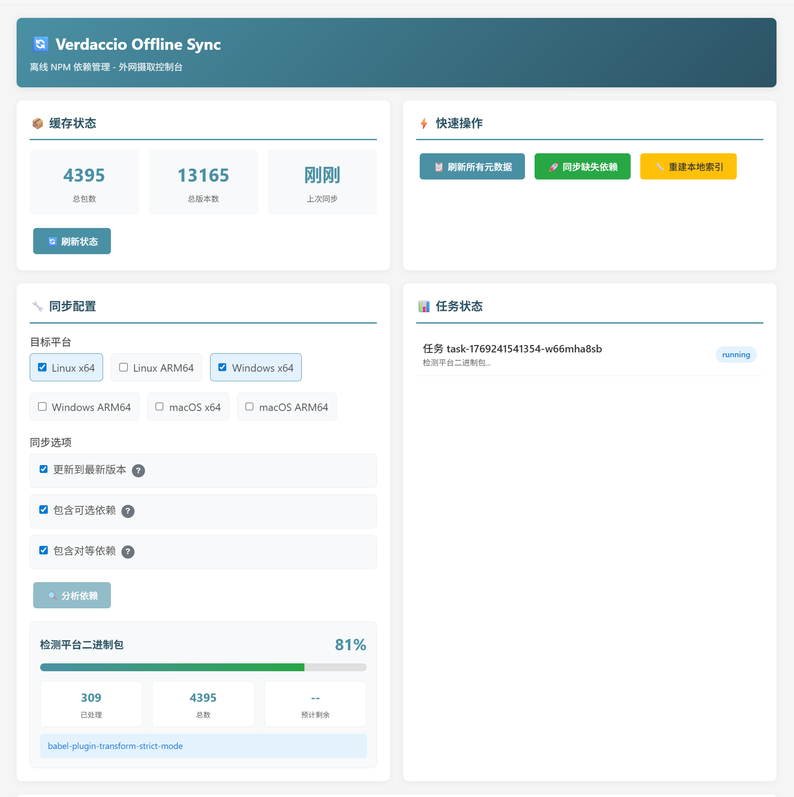
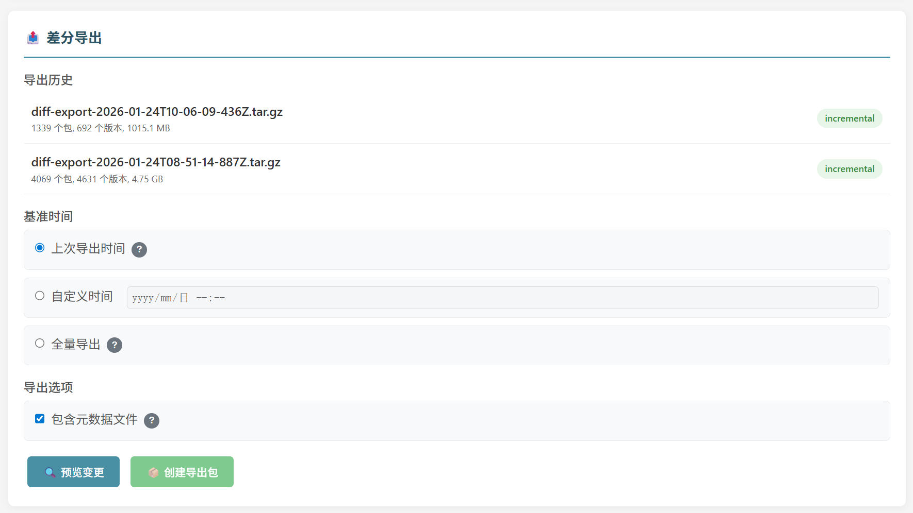
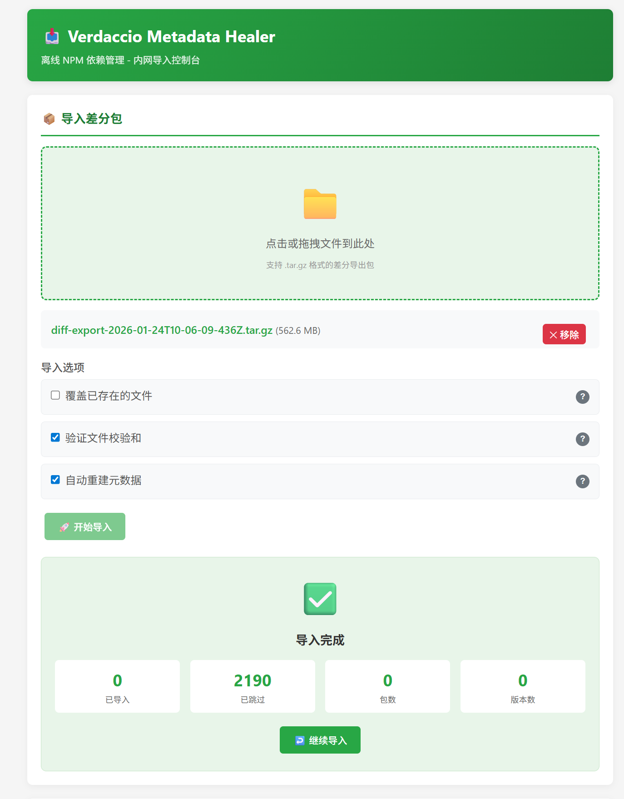

# Verdaccio Offline Sync

[English](./README.en.md) | 中文

[](https://www.npmjs.com/package/verdaccio-ingest-middleware)
[](https://www.npmjs.com/package/verdaccio-metadata-healer)
[](https://www.npmjs.com/package/@jayxuz/verdaccio-offline-storage)
[](https://hub.docker.com/r/jayxuz/verdaccio-offline-sync)
[](https://hub.docker.com/r/jayxuz/verdaccio-offline-sync)
[](https://opensource.org/licenses/MIT)

> **告别内网依赖管理的噩梦**
>
> 还在手动打包 `node_modules` 然后祈祷解压后能正常工作吗？
> 还在为了更新一个包版本而重新导入整个项目的依赖包吗？
> 还在为 esbuild、sharp 等原生模块的平台兼容问题抓狂吗？
> 还在面对 `npm install` 报错时不知道到底缺了哪个依赖吗？
>
> **Verdaccio Offline Sync** 让内外网 npm 依赖同步变得简单：
> - 智能分析依赖树，一键下载所有缺失的包
> - 增量导出，只传输新增和变更的文件
> - 自动处理多平台二进制包
> - 元数据自愈，导入即可用

**Verdaccio 离线 NPM 依赖管理插件套件** - 专为内外网隔离环境设计的 npm 包同步解决方案。

## 核心特性

- **递归依赖下载** - 自动分析并下载完整的依赖树
- **多平台二进制支持** - 支持 Linux/Windows/macOS 的 x64/arm64 架构
- **增量同步** - 基于已缓存包的智能增量更新
- **差分导出/导入** - 支持基于时间点的差分包导出和内网导入
- **可视化管理界面** - 内置 Web UI，支持分析-确认-下载工作流
- **实时进度追踪** - 显示详细进度、预估剩余时间
- **元数据自愈** - 内网自动修复缺失的包元数据
- **元数据同步** - 支持从上游仓库同步包元数据到本地，支持单包和批量同步
- **同级版本补全** - 自动下载同 minor 最新 patch 和同 major 最新 minor 版本
- **本地路径导入** - 支持从服务器本地路径直接导入差分包
- **链式依赖与重建增强** - 修复链式依赖漏下载问题，增强 `/ingest/sync` 与 `/ingest/rebuild-index` 的元数据写回能力
- **清单并发写入保护** - 通过 Verdaccio package storage 串行持久化同步与重建产生的元数据，避免并发直接写入 `package.json` 时相互覆盖
- **本地清单规范化** - 读写前修复缺失或异常的 `versions`、`dist-tags`、attachments、distfiles 等映射字段，提高历史缓存兼容性
- **Scoped 包文件名兼容** - 同时兼容 `package-x.y.z.tgz` 与 `scope-package-x.y.z.tgz` 两种 tarball 命名
- **完整性校验** - 下载后自动校验 tarball SHA-1，防止损坏包污染本地缓存；本地版本解析时同步校验文件完整性，自动剔除损坏文件

## 插件组成

| 插件 | 部署位置 | 功能 |
|------|----------|------|
| `@jayxuz/verdaccio-offline-storage` | 外网/内网 | 基础存储层，支持离线版本解析 |
| `verdaccio-ingest-middleware` | 外网 | 递归摄取中间件，提供 Web UI，支持差分导出和同级版本补全 |
| `verdaccio-metadata-healer` | 内网 | 元数据自愈过滤器，支持差分导入、本地路径导入和元数据同步 |


### Web UI 管理界面

<p align="center">
  
</p>

### 差分导出

<p align="center">
  
</p>

### 差分导入

<p align="center">
  
</p>

## 快速开始

### 使用 Docker 镜像（推荐）

我们提供了预构建的 Docker 镜像，包含所有插件，开箱即用：

```bash
# 设置数据目录
export V_PATH=/path/to/verdaccio

# 启动容器
docker run -it --name verdaccio \
  -p 4873:4873 \
  -v $V_PATH/conf:/verdaccio/conf \
  -v $V_PATH/storage:/verdaccio/storage \
  jayxuz/verdaccio-offline-sync
```

目录结构：
```
$V_PATH/
├── conf/
│   └── config.yaml    # 配置文件（外网或内网配置）
└── storage/
    └── data/          # 包存储目录
```

> 提示：通过挂载不同的配置文件来区分外网/内网环境，参考下方的配置示例。

---

### 手动安装

如果不使用 Docker，可以手动安装插件：

#### 1. 安装前置依赖

```bash
# 安装离线存储插件（必需）
npm install -g @jayxuz/verdaccio-offline-storage
```

#### 2. 安装插件

```bash
# 外网环境
npm install -g verdaccio-ingest-middleware

# 内网环境
npm install -g verdaccio-metadata-healer
```

### 在线与离线配置角色

在线代理缓存与离线消费/导入是两个互斥的部署角色：

- **在线侧**配置 uplink 和 `packages.proxy`，由 `ingest-middleware` 从上游分析、下载并导出缓存；`offline-storage` 必须设置为 `offline: false`。
- **离线侧**不配置 uplink、proxy 或 `ingest-middleware`，由 `offline-storage` 在 `offline: true` 下只解析本地包，并保留 `metadata-healer` filter 修复元数据。离线示例完全不声明 `middlewares`，因此不会注册导入路由。

不要在同一个 Verdaccio 实例中同时启用 ingest 与 healer。ingest 依赖上游并负责写入在线缓存，healer 面向隔离存储并可能修复或导入元数据；两者同时操作同一 storage 会混淆网络边界和数据所有权，并引入并发写入、错误回源或把未验证数据再次导出的风险。请使用独立实例或至少独立配置与 storage。

- 在线侧完整示例：[examples/config-online.yaml](./examples/config-online.yaml)
- 离线侧完整示例：[examples/config-offline.yaml](./examples/config-offline.yaml)

两个示例中的 `access`/`publish` 规则只为说明结构。部署时必须保留并审查生产环境现有访问控制，不要用示例权限覆盖生产配置。示例使用相对 storage 路径，实际部署请根据 Verdaccio 运行目录或容器挂载调整。

真实实现只有在 `middlewares.metadata-healer.enableImportUI` 为 `true` 时才注册导入路由；通用的 `enabled: false` 不能作为这里的保护。确实需要 Web UI 导入差分包时，才在离线配置中显式新增：

```yaml
middlewares:
  metadata-healer:
    enableImportUI: true
```

修改配置后可先运行以下人工核对辅助命令：

```bash
rg -n "ingest-middleware|metadata-healer|offline:|proxy:" examples/config-*.yaml
```

辅助输出仍需人工解释；需要可复制、以退出码表示成功或失败的断言时，运行：

```bash
set -eu
! rg -n 'metadata-healer' examples/config-online.yaml
! rg -n 'ingest-middleware|proxy:|^uplinks:|^middlewares:' examples/config-offline.yaml
test "$(rg -c '^    offline: false$' examples/config-online.yaml)" -eq 1
test "$(rg -c '^    offline: true$' examples/config-offline.yaml)" -eq 1
test "$(rg -c '^    proxy: npmjs$' examples/config-online.yaml)" -eq 2
test "$(rg -c '^  metadata-healer:$' examples/config-offline.yaml)" -eq 1
```

验收规则：在线配置只能出现 `ingest-middleware`，必须是 `offline: false`，并为两类包规则设置 `proxy`；离线配置只能出现 filter 下的 `metadata-healer`，必须是 `offline: true`，且不能含 uplink、任何 middleware 或任何 `proxy`。

### 存储清单迁移与回滚

仓库提供 `scripts/repair-storage-manifests.mjs`，用于规范化历史 `package.json` 中的 `_attachments` 等映射字段，并根据版本元数据回填 `_distfiles` 条目。以下路径都是占位示例，运行前必须替换为本机绝对路径；storage 与 backup 不能相同，backup 也不能位于 storage 内。

先执行只读 dry-run，并用 `jq` 检查报告：

```bash
# 必须替换为本机实际路径。
REPO_ROOT=/absolute/path/to/verdaccio-offline-sync
STORAGE_DIR=/absolute/path/to/verdaccio/storage/data
DRY_RUN_REPORT=/tmp/verdaccio-manifest-dry-run.json

node "$REPO_ROOT/scripts/repair-storage-manifests.mjs" \
  --storage "$STORAGE_DIR" | tee "$DRY_RUN_REPORT"
jq -e '.fileErrors == 0 and .parseErrors == 0' "$DRY_RUN_REPORT"
```

确认 dry-run 的范围和错误数后再 apply。**apply 前必须停止所有读写该 storage 的 Verdaccio 实例或容器**，并提供 storage 外部的绝对 backup 目录：

```bash
# 必须替换为本机实际路径；BACKUP_DIR 应是专用于本次迁移的新目录。
APPLY_REPORT=/tmp/verdaccio-manifest-apply.json
BACKUP_DIR=/absolute/path/outside-storage/manifest-backup-YYYYMMDD

node "$REPO_ROOT/scripts/repair-storage-manifests.mjs" \
  --storage "$STORAGE_DIR" \
  --apply \
  --backup-dir "$BACKUP_DIR" | tee "$APPLY_REPORT"
jq -e '.fileErrors == 0 and .parseErrors == 0 and .modified == .backups' \
  "$APPLY_REPORT"
```

本次已完成迁移的校验摘要如下，证据来自本次任务的终端输出与发布记录，仅用于追溯本次执行，不是未来运行的硬编码期望值；后续迁移应以当次 dry-run/apply 报告为准：

| 指标 | 本次记录 |
|------|---------:|
| dry-run/apply `scan` | 10478 |
| dry-run `wouldModify` | 5842 |
| dry-run `missingAttachments` | 1436 |
| dry-run `missingDistfiles` | 5574 |
| dry-run `parseErrors` | 0 |
| dry-run `backfilledDistfiles` | 721518 |
| apply `modified` | 5842 |
| apply `backups` | 5842 |
| apply `fileErrors` | 0 |
| post-scan `wouldModify` | 0 |
| post-scan `missingAttachments` | 0 |
| post-scan `missingDistfiles` | 0 |
| post-scan `parseErrors` | 0 |

apply 后、重新启动 Verdaccio 前，再次 dry-run 复扫并用 `jq` 验收；同时可让 `jq` 逐个解析所有清单：

```bash
POST_REPORT=/tmp/verdaccio-manifest-post-scan.json
node "$REPO_ROOT/scripts/repair-storage-manifests.mjs" \
  --storage "$STORAGE_DIR" | tee "$POST_REPORT"
jq -e '.wouldModify == 0 and .parseErrors == 0 and .fileErrors == 0' "$POST_REPORT"
find "$STORAGE_DIR" -type f -name package.json -exec jq -e empty {} +
```

如果需要回滚，先再次停止 Verdaccio。备份目录保持与 storage 相同的相对目录结构，因此只按相对路径还原备份的 `package.json`，不要恢复整个 storage 卷，也不要覆盖或删除 `.tgz`。

先运行以下只读检查，确认两个目录都能规范化为已存在的绝对目录、互不嵌套，并人工抽查待还原文件列表：

```bash
(
  set -eu
  backup_real=$(realpath -e -- "$BACKUP_DIR")
  storage_real=$(realpath -e -- "$STORAGE_DIR")
  [ -d "$backup_real" ] && [ -d "$storage_real" ]
  [ "$backup_real" != / ] && [ "$storage_real" != / ]
  case "$backup_real" in
    "$storage_real"|"$storage_real"/*)
      echo '拒绝回滚：backup 与 storage 相同或位于 storage 内' >&2
      exit 1
      ;;
  esac
  case "$storage_real" in
    "$backup_real"|"$backup_real"/*)
      echo '拒绝回滚：storage 位于 backup 内' >&2
      exit 1
      ;;
  esac
  find "$backup_real" -type f -name package.json -print
)
```

确认列表只包含本次备份的目标清单后，再运行还原命令：

```bash
(
  set -eu
  backup_real=$(realpath -e -- "$BACKUP_DIR")
  storage_real=$(realpath -e -- "$STORAGE_DIR")
  [ -d "$backup_real" ] && [ -d "$storage_real" ]
  [ "$backup_real" != / ] && [ "$storage_real" != / ]
  case "$backup_real" in
    "$storage_real"|"$storage_real"/*)
      echo '拒绝回滚：backup 与 storage 相同或位于 storage 内' >&2
      exit 1
      ;;
  esac
  case "$storage_real" in
    "$backup_real"|"$backup_real"/*)
      echo '拒绝回滚：storage 位于 backup 内' >&2
      exit 1
      ;;
  esac
  cd -- "$backup_real" &&
    find . -type f -name package.json -print0 \
      | xargs -0 -r cp --archive --parents --target-directory="$storage_real" --
)
```

回滚后重复执行 dry-run 与 `jq` 检查，再决定是否重新启动服务。原始生产报告按要求与生产 storage、backup 一起存放在仓库外，不得加入 Git；README 只保留上述校验摘要。所有生产数据应按组织的数据保护和保留策略管理。

## Web UI 使用指南

访问 `http://external:4873/_/ingest/ui` 打开管理界面。

### 功能模块

#### 1. 缓存状态

显示当前本地缓存的统计信息：
- 总包数
- 总版本数
- 上次同步时间

#### 2. 快速操作

| 按钮 | 功能 |
|------|------|
| 刷新所有元数据 | 从上游仓库更新所有已缓存包的元数据 |
| 同步缺失依赖 | 跳转到同步配置区域 |
| 重建本地索引 | 扫描存储目录，修复元数据（内网使用） |

#### 3. 同步配置

**目标平台选择：**
- Linux x64 / ARM64
- Windows x64 / ARM64
- macOS x64 / ARM64

**同步选项：**
| 选项 | 说明 |
|------|------|
| 分析前全量刷新元数据 | 从上游刷新所有本地缓存包元数据（默认关闭） |
| 更新到最新版本 | 检查已缓存包是否有更新版本 |
| 补全同级版本 | 对每个已缓存版本，下载同 minor 最新 patch 和同 major 最新 minor |
| 包含可选依赖 | 下载 optionalDependencies（平台二进制包） |
| 包含对等依赖 | 下载 peerDependencies |

#### 4. 分析-确认-下载工作流

```
┌─────────────┐     ┌─────────────┐     ┌─────────────┐
│  分析依赖    │ ──▶│  确认列表    │ ──▶│  执行下载   │
└─────────────┘     └─────────────┘     └─────────────┘
      │                   │                   │
      ▼                   ▼                   ▼
 显示详细进度        展示待下载包        显示下载结果
 - 当前阶段          - 包名@版本         - 成功/失败数
 - 百分比            - 下载原因          - 失败列表
 - 预估剩余时间      - 支持取消          - 支持重试
 - 当前处理的包
```

**分析阶段进度：**
| 阶段 | 进度范围 | 说明 |
|------|----------|------|
| 扫描本地缓存 | 0-5% | 扫描 storage 目录 |
| 准备元数据 | 5-25% | 默认加载本地元数据，仅在启用升级/同级补全时刷新上游 |
| 分析依赖关系 | 25-75% | BFS 遍历依赖树 |
| 定向更新元数据 | 75-85% | 仅同步缺口依赖的元数据 |
| 检测平台二进制包 | 85-95% | 识别需要下载的平台包 |
| 完成 | 100% | 生成下载列表 |

#### 5. 执行日志

- 实时显示操作日志
- 支持日志导出（TXT 格式）
- 支持清空日志

#### 6. 已缓存的包列表

显示本地已缓存的包：
- 包名
- 版本数量
- 最新缓存版本

#### 7. 差分导出（外网）

在 Web UI 底部的「📤 差分导出」卡片中：

**导出历史：** 显示最近的导出记录

**基准时间选择：**
| 选项 | 说明 |
|------|------|
| 上次导出时间 | 从上次导出时间点开始，只导出新增或修改的文件 |
| 自定义时间 | 手动指定基准时间点 |
| 全量导出 | 导出所有文件，不考虑时间点 |

**导出选项：**
- 包含元数据文件：是否包含 package.json 文件

**工作流程：**
```
预览变更 → 查看待导出文件列表 → 创建导出包 → 下载 tar.gz
```

**导出包结构：**
```
diff-export-2024-01-15T10-30-00.tar.gz
├── .export-manifest.json      # 导出清单（包含文件列表和校验和）
├── react/
│   ├── package.json
│   └── react-18.2.0.tgz
├── @esbuild%2flinux-x64/
│   └── linux-x64-0.19.0.tgz
└── lodash/
    └── lodash-4.17.21.tgz
```

#### 8. 差分导入（内网）

访问 `http://internal:4873/_/healer/ui` 打开导入管理界面。

**上传差分包：**
- 支持拖拽上传或点击选择文件
- 只接受 .tar.gz 或 .tgz 格式

**导入选项：**
| 选项 | 说明 |
|------|------|
| 覆盖已存在的文件 | 如果目标文件已存在，是否覆盖（默认跳过） |
| 验证文件校验和 | 导入前验证 SHA256 校验和，确保文件完整性 |
| 自动重建元数据 | 导入后触发元数据重建，使新包立即可用 |

**导入进度阶段：**
| 阶段 | 说明 |
|------|------|
| 解压文件 | 解压 tar.gz 到临时目录 |
| 验证校验和 | 验证每个文件的 SHA256 |
| 导入文件 | 复制文件到 storage 目录 |
| 重建元数据 | 触发元数据自动重建 |

## 架构图

```
┌─────────────────────────────────────────────────────────────────────┐
│                         外网环境                                    │
│  ┌─────────────────────────────────────────────────────────────┐   │
│  │  Verdaccio + offline-storage + ingest-middleware            │   │
│  │                                                             │   │
│  │  Web UI: http://external:4873/_/ingest/ui                   │   │
│  │  ├── 缓存状态查看                                            │   │
│  │  ├── 分析依赖 → 确认下载列表 → 执行下载                       │   │
│  │  ├── 实时进度追踪（百分比、预估时间、当前包）                  │   │
│  │  └── 📤 差分导出（基于时间点导出增量包）                      │   │
│  └─────────────────────────────────────────────────────────────┘   │
│                              │                                      │
│                              ▼                                      │
│                    storage/ 目录                                    │
│                    ├── react/                                       │
│                    │   ├── package.json                             │
│                    │   └── react-18.2.0.tgz                         │
│                    ├── @esbuild%2flinux-x64/                        │
│                    │   └── linux-x64-0.19.0.tgz                     │
│                    ├── .export-history.json  ← 导出历史记录          │
│                    └── .exports/             ← 导出包存放目录        │
│                        └── diff-export-2024-01-15T10-30-00.tar.gz   │
└─────────────────────────────────────────────────────────────────────┘
                               │
                               │ 方式1: rsync -avz --ignore-existing
                               │ 方式2: 下载差分包 → 内网导入
                               ▼
┌─────────────────────────────────────────────────────────────────────┐
│                         内网环境                                     │
│  ┌─────────────────────────────────────────────────────────────┐   │
│  │  Verdaccio + offline-storage + metadata-healer              │   │
│  │                                                             │   │
│  │  导入 UI: http://internal:4873/_/healer/ui                  │   │
│  │  ├── 📥 上传差分包                                          │   │
│  │  ├── 📂 从本地路径导入差分包                                 │   │
│  │  ├── 导入选项（覆盖/校验/重建元数据）                         │   │
│  │  ├── 🔄 元数据同步（单包/批量同步）                          │   │
│  │  └── 导入历史记录                                            │   │
│  │                                                             │   │
│  │  npm install react --registry http://internal:4873          │   │
│  │  ├── offline-storage 本地解析版本                            │   │
│  │  ├── metadata-healer 动态修复缺失元数据                      │   │
│  │  └── 自动选择当前平台的二进制包                               │   │
│  └─────────────────────────────────────────────────────────────┘   │
└─────────────────────────────────────────────────────────────────────┘
```

## API 端点

### 外网插件 (ingest-middleware)

| 端点 | 方法 | 描述 |
|------|------|------|
| `/_/ingest/ui` | GET | Web 管理界面 |
| `/_/ingest/cache` | GET | 查看本地缓存状态 |
| `/_/ingest/refresh` | POST | 刷新已缓存包的元数据 |
| `/_/ingest/analyze` | POST | 分析依赖（异步任务） |
| `/_/ingest/analysis/:id` | GET | 获取分析结果 |
| `/_/ingest/download` | POST | 执行下载（基于分析结果） |
| `/_/ingest/retry` | POST | 重试失败的下载 |
| `/_/ingest/sync` | POST | 一键同步（分析+下载） |
| `/_/ingest/platform` | POST | 下载指定包的多平台版本 |
| `/_/ingest/status/:taskId` | GET | 查询任务状态 |
| `/_/ingest/rebuild-index` | POST | 重建本地索引 |
| `/_/ingest/export/history` | GET | 获取导出历史 |
| `/_/ingest/export/preview` | POST | 预览待导出文件 |
| `/_/ingest/export/create` | POST | 创建差分导出包 |
| `/_/ingest/export/download/:exportId` | GET | 下载导出包 |

### 内网插件 (metadata-healer)

| 端点 | 方法 | 描述 |
|------|------|------|
| `/_/healer/ui` | GET | 导入管理界面 |
| `/_/healer/import/upload` | POST | 上传并导入差分包 |
| `/_/healer/import/local` | POST | 从服务器本地路径导入差分包 |
| `/_/healer/import/status/:taskId` | GET | 查询导入任务状态 |
| `/_/healer/import/history` | GET | 获取导入历史 |
| `/_/healer/sync/:name` | POST | 同步单个包的元数据 |
| `/_/healer/sync/:scope/:name` | POST | 同步 scoped 包的元数据 |
| `/_/healer/sync-all` | POST | 同步所有本地包的元数据 |
| `/_/healer/sync/status/:taskId` | GET | 查询同步任务状态 |
| `/_/healer/packages` | GET | 列出所有本地包 |

### API 示例

#### 分析依赖

```bash
curl -X POST http://external:4873/_/ingest/analyze \
  -H "Content-Type: application/json" \
  -d '{
    "platforms": [
      {"os": "linux", "arch": "x64", "libc": "glibc"},
      {"os": "win32", "arch": "x64"}
    ],
    "options": {
      "updateToLatest": true,
      "includeOptional": true,
      "includePeer": true
    }
  }'

# 响应
{
  "success": true,
  "taskId": "task-1234567890-abc123",
  "message": "Analysis task started"
}
```

#### 查询任务状态

```bash
curl http://external:4873/_/ingest/status/task-1234567890-abc123

# 响应（进行中）
{
  "taskId": "task-1234567890-abc123",
  "status": "running",
  "progress": 45,
  "message": "分析依赖 (层级 2): lodash",
  "detailedProgress": {
    "phase": "analyzing",
    "phaseProgress": 60,
    "totalProgress": 45,
    "currentPackage": "lodash@4.17.21",
    "processed": 120,
    "total": 200,
    "estimatedRemaining": 30000,
    "phaseDescription": "分析依赖 (层级 2): lodash"
  }
}

# 响应（完成）
{
  "taskId": "task-1234567890-abc123",
  "status": "completed",
  "progress": 100,
  "result": {
    "analysisId": "analysis-1234567890-xyz789",
    "scanned": 150,
    "refreshed": 150,
    "toDownload": [...],
    "platforms": ["linux-x64", "win32-x64"],
    "timestamp": 1234567890000
  }
}
```

#### 执行下载

```bash
curl -X POST http://external:4873/_/ingest/download \
  -H "Content-Type: application/json" \
  -d '{
    "analysisId": "analysis-1234567890-xyz789"
  }'
```

## 同步工作流

### 方式一：rsync 直接同步

```bash
# 1. 外网：打开 Web UI 进行同步
#    访问 http://external:4873/_/ingest/ui
#    选择目标平台 → 分析依赖 → 确认下载 → 执行下载

# 2. 差分同步到内网
rsync -avz --ignore-existing /external/storage/ /internal/storage/

# 3. 内网：重建索引（首次或有问题时）
curl -X POST http://internal:4873/_/ingest/rebuild-index

# 4. 内网：正常使用
npm install <package> --registry http://internal:4873
```

### 方式二：差分包导出/导入（推荐）

适用于无法直接 rsync 的场景（如通过 U 盘传输）。

```bash
# 1. 外网：打开 Web UI
#    访问 http://external:4873/_/ingest/ui

# 2. 外网：下载依赖（同方式一）
#    选择目标平台 → 分析依赖 → 确认下载 → 执行下载

# 3. 外网：创建差分导出包
#    在「📤 差分导出」卡片中：
#    选择基准时间（上次导出/自定义/全量）→ 预览变更 → 创建导出包 → 下载

# 4. 将 diff-export-xxx.tar.gz 传输到内网

# 5. 内网：打开导入 Web UI
#    访问 http://internal:4873/_/healer/ui

# 6. 内网：上传并导入差分包
#    拖拽上传 → 选择导入选项 → 开始导入

# 7. 内网：正常使用
npm install <package> --registry http://internal:4873
```

### 命令行方式

```bash
# 外网：一键同步
curl -X POST http://external:4873/_/ingest/sync \
  -H "Content-Type: application/json" \
  -d '{
    "platforms": [
      {"os": "linux", "arch": "x64", "libc": "glibc"},
      {"os": "win32", "arch": "x64"}
    ],
    "options": {
      "updateToLatest": true,
      "includeOptional": true
    }
  }'
```

## 多平台二进制包支持

自动检测并下载以下类型的平台特定包：

| 包名模式 | 示例 |
|----------|------|
| `@esbuild/*` | @esbuild/linux-x64, @esbuild/win32-x64 |
| `@swc/core-*` | @swc/core-linux-x64-gnu, @swc/core-win32-x64-msvc |
| `@rollup/rollup-*` | @rollup/rollup-linux-x64-gnu |
| `@img/sharp-*` | @img/sharp-linux-x64, @img/sharp-win32-x64 |

## 配置参考

### ingest-middleware 配置项

| 配置项 | 类型 | 默认值 | 说明 |
|--------|------|--------|------|
| `enabled` | boolean | true | 是否启用插件 |
| `upstreamRegistry` | string | 取自 uplinks 配置 | 上游仓库地址（未配置时自动从 uplinks 中获取第一个 uplink 的 URL） |
| `concurrency` | number | 5 | 并发处理数（下载/扫描/分析/导出链路） |
| `timeout` | number | 60000 | 请求超时（毫秒） |
| `platforms` | array | - | 目标平台列表 |
| `sync.refreshAllMetadataBeforeAnalyze` | boolean | false | 分析前是否全量刷新元数据 |
| `sync.updateToLatest` | boolean | false | 是否更新到最新版本 |
| `sync.completeSiblingVersions` | boolean | false | 是否补全同级版本（同 minor 最新 patch + 同 major 最新 minor） |
| `sync.includeDev` | boolean | false | 是否包含 devDependencies |
| `sync.includePeer` | boolean | true | 是否包含 peerDependencies |
| `sync.includeOptional` | boolean | true | 是否包含 optionalDependencies |
| `sync.maxDepth` | number | 10 | 依赖树最大深度 |
| `verifyChecksum` | boolean | true | 下载后校验 tarball SHA-1 是否与上游一致 |
| `minTarballSize` | number | 128 | tarball 最小体积（字节），低于此值视为损坏 |

### offline-storage 配置项

| 配置项 | 类型 | 默认值 | 说明 |
|--------|------|--------|------|
| `offline` | boolean | false | 强制离线模式（所有包本地解析） |
| `verifyChecksum` | boolean | true | 校验本地 tarball SHA-1 是否与 metadata 一致 |
| `minTarballSize` | number | 128 | tarball 最小体积（字节），低于此值视为损坏 |

### metadata-healer 配置项

| 配置项 | 类型 | 默认值 | 说明 |
|--------|------|--------|------|
| `enabled` | boolean | true | 是否启用插件 |
| `syncConcurrency` | number | 5 | 批量元数据同步并发数（`/sync-all`） |
| `scanCacheTTL` | number | 60000 | 扫描缓存 TTL（毫秒） |
| `shasumCacheSize` | number | 10000 | shasum 缓存大小 |
| `autoUpdateLatest` | boolean | true | 自动更新 latest 标签 |

## 项目结构

```
verdaccio-offline-sync/
├── packages/
│   ├── verdaccio-ingest-middleware/     # 外网侧插件
│   │   ├── src/
│   │   │   ├── index.ts                 # 入口
│   │   │   ├── ingest-middleware.ts     # 中间件主类
│   │   │   ├── dependency-resolver.ts   # 依赖树解析
│   │   │   ├── package-downloader.ts    # 包下载器
│   │   │   ├── storage-scanner.ts       # 存储扫描器
│   │   │   ├── differential-scanner.ts  # 差分文件扫描器
│   │   │   ├── differential-packer.ts   # 差分打包器
│   │   │   ├── web-ui.ts                # Web UI 模板
│   │   │   └── types.ts                 # 类型定义
│   │   └── package.json
│   │
│   └── verdaccio-metadata-healer/       # 内网侧插件
│       ├── src/
│       │   ├── index.ts                 # 入口
│       │   ├── healer-filter.ts         # 过滤器主类
│       │   ├── import-middleware.ts     # 导入中间件
│       │   ├── import-handler.ts        # 导入处理器
│       │   ├── import-ui.ts             # 导入 Web UI
│       │   ├── storage-scanner.ts       # 存储扫描器
│       │   ├── metadata-patcher.ts      # 元数据修补器
│       │   ├── metadata-syncer.ts      # 元数据同步器
│       │   ├── shasum-cache.ts          # shasum 缓存
│       │   └── types.ts                 # 类型定义
│       └── package.json
│
├── package.json                         # monorepo 配置
├── pnpm-workspace.yaml
└── README.md
```

## 开发

```bash
# 安装依赖
pnpm install

# 构建所有包
pnpm build

# 构建单个包
pnpm --filter verdaccio-ingest-middleware build

# 测试
pnpm test

# 开发模式（监听变化）
pnpm dev
```

## 常见问题

### Q: 内网安装时提示找不到包？

1. 确认包已同步到内网 storage 目录
2. 运行 `重建本地索引` 修复元数据
3. 检查 `offline-storage` 插件是否正确配置

### Q: 平台二进制包下载不完整？

1. 在 Web UI 中勾选所有需要的目标平台
2. 确保 `includeOptional` 选项已启用
3. 检查上游仓库是否可访问

### Q: 分析进度卡住？

1. 检查网络连接
2. 查看执行日志中的错误信息
3. 尝试减少并发数（`concurrency` 配置）

### Q: 如何只同步特定包？

使用 API 直接指定包列表：

```bash
curl -X POST http://external:4873/_/ingest/download \
  -H "Content-Type: application/json" \
  -d '{
    "packages": [
      {"name": "react", "version": "18.2.0", "reason": "missing-dependency"},
      {"name": "lodash", "version": "4.17.21", "reason": "missing-dependency"}
    ]
  }'
```

## License

MIT
